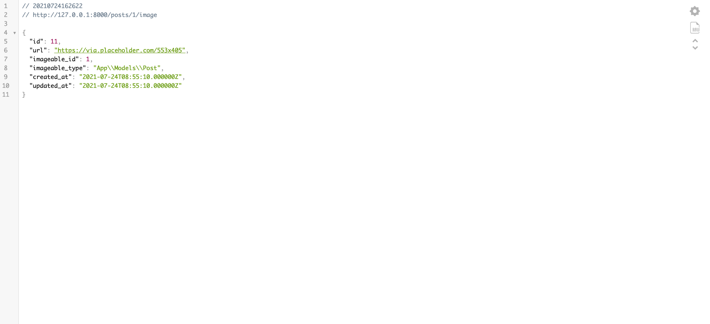
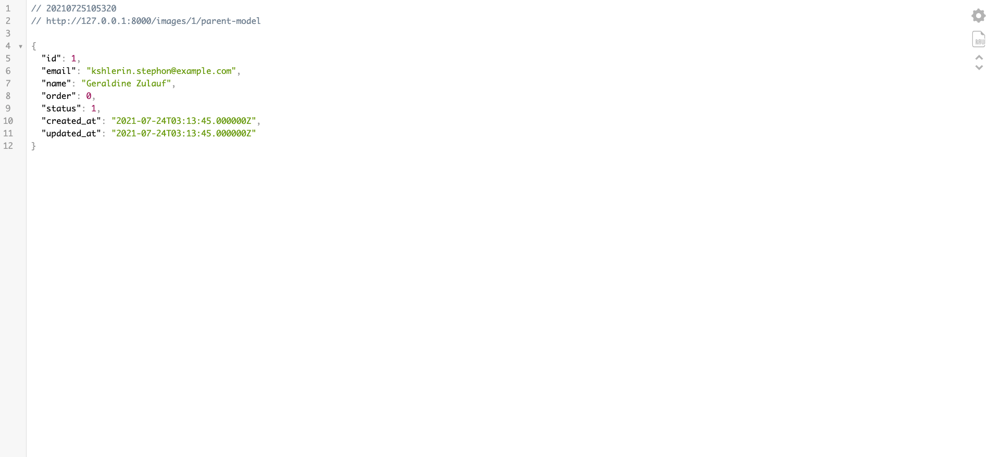
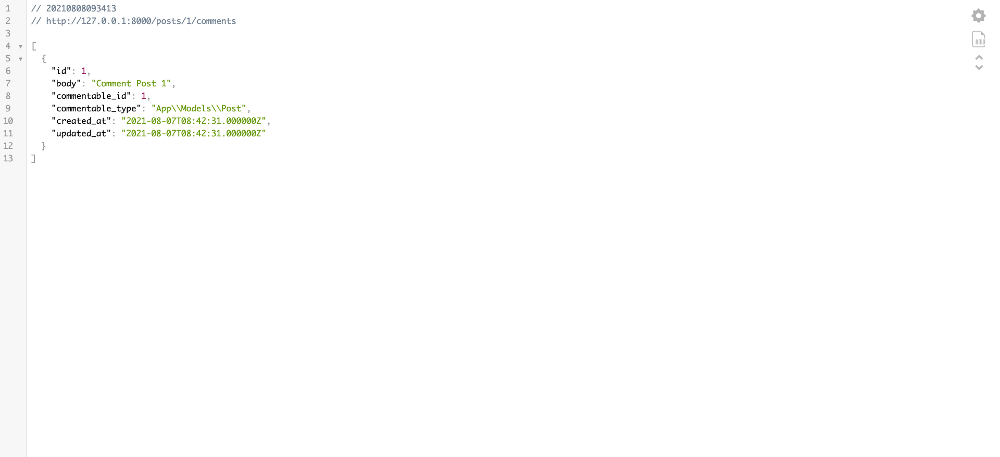
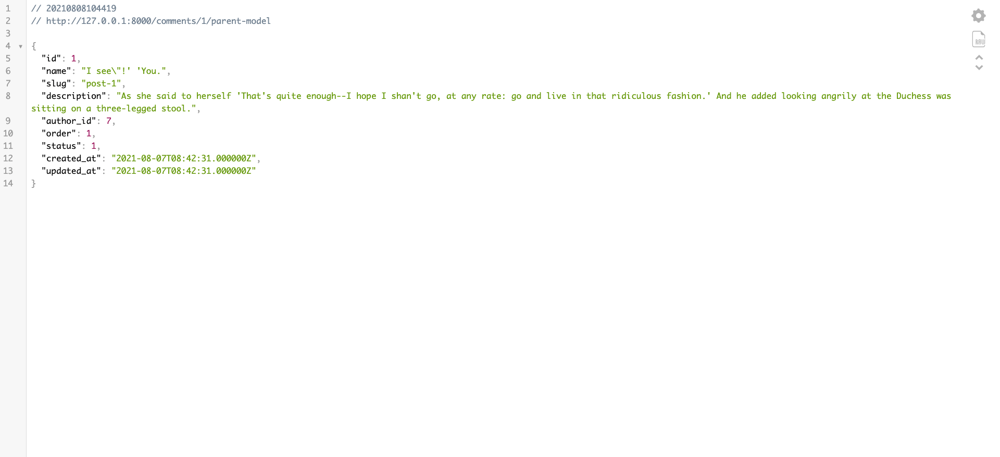

# Các kiểu quan hệ giữa các bảng trong Laravel phần 3
Chào các bạn, bài này là phần 3 trong series 4 phần về các kiểu quan hệ trong Laravel. Trong bài này chúng ta sẽ đề cập đến các kiểu quan hệ đa hình (Polymorphic Relationships).

## Quan hệ đa hình là gì
Mối quan hệ đa hình cho phép mô hình con thuộc về nhiều loại mô hình bằng cách sử dụng một kết hợp duy nhất. Ví dụ: hãy tưởng tượng bạn đang xây dựng một ứng dụng cho phép người dùng chia sẻ các bài đăng trên blog và video. Trong một ứng dụng như vậy, mô hình Nhận xét có thể thuộc về cả mô hình Bài đăng và Video.

## Kiểu quan hệ One To One (Polymorphic)
### Cấu trúc bảng
Quan hệ đa hình một đối một tương tự như quan hệ một đối một điển hình; tuy nhiên, mô hình con có thể thuộc về nhiều loại mô hình bằng cách sử dụng một kết hợp duy nhất. 

Ví dụ: Bảng `users` và bảng `posts` có thể sử dụng chung bảng `images`. Vì thế chúng ta có cấu trúc bảng như sau:
```
users
    id - integer
    name - string

posts
    id - integer
    name - string

images
    id - integer
    url - string
    imageable_id - integer
    imageable_type - string
```

Lưu ý cột `imageable_id` và `imageable_type` trên bảng `images`. Cột `imageable_id` sẽ chứa giá trị `ID` của bảng `users` hoặc bảng `posts`, trong khi cột `imageable_type` sẽ lưu tên class của `Model` đại diện của 2 bảng `users` và `posts`, trong trường hợp này cột `imageable_type` sẽ lưu `App\Models\User` hoặc `App\Models\Post` tương ứng với 2 bảng `users` và `posts`.

### Cấu trúc Model
Tiếp theo, hãy xem xét cấu trúc Model cần thiết để xây dựng mối quan hệ này:
```php
<?php

namespace App\Models;

use Illuminate\Database\Eloquent\Model;

class Image extends Model
{
    /**
     * Get the parent imageable model (user or post).
     */
    public function imageable()
    {
        return $this->morphTo();
    }
}

class Post extends Model
{
    /**
     * Get the post's image.
     */
    public function image()
    {
        return $this->morphOne(Image::class, 'imageable');
    }
}

class User extends Model
{
    /**
     * Get the user's image.
     */
    public function image()
    {
        return $this->morphOne(Image::class, 'imageable');
    }
}
```

### Tạo dữ liệu mẫu
Chúng ta cần tạo dữ liệu mẫu cho bảng `images` bằng cách tạo file `ImagesTableSeeder` bằng câu lệnh
```
php artisan make:seeder ImagesTableSeeder
```

Nội dung file ImagesTableSeeder:
```php
<?php

namespace Database\Seeders;

use App\Models\Post;
use App\Models\User;
use App\Models\Image;
use Illuminate\Database\Seeder;

class ImagesTableSeeder extends Seeder
{
    /**
     * Run the database seeds.
     *
     * @return void
     */
    public function run()
    {
        $users = User::get();
        $posts = Post::get();
        Image::truncate();

        foreach ($users as $user) {
            $width = mt_rand(300, 800);
            $height = mt_rand(300, 800);
            Image::create([
                'url' => 'https://via.placeholder.com/' . $width . 'x' . $height,
                'imageable_id' => $user->id,
                'imageable_type' => User::class,
            ]);
        }

        foreach ($posts as $post) {
            $width = mt_rand(300, 800);
            $height = mt_rand(300, 800);
            Image::create([
                'url' => 'https://via.placeholder.com/' . $width . 'x' . $height,
                'imageable_id' => $post->id,
                'imageable_type' => Post::class,
            ]);
        }
    }
}
```

Cuối cùng để tạo dữ liệu mẫu, chúng ta sử dụng câu lệnh để thực thi file `ImagesTableSeeder`
```
php artisan db:seed --class=ImagesTableSeeder
```

### Truy xuất dữ liệu
Khi bảng cơ sở dữ liệu và các mô hình của bạn được xác định, bạn có thể truy cập các mối quan hệ thông qua các mô hình của mình. Ví dụ: để truy xuất hình ảnh cho một bài đăng, chúng ta có thể truy cập thuộc tính mối quan hệ động hình ảnh:

```php
use App\Models\Post;

$post = Post::find(1);

$image = $post->image;
```

Để có thể nhìn trực quan dữ liệu, chúng ta có thể tạo 1 `PostController` có phương thức `getImageOfPost` để lấy ra hình ảnh cho một bài đăng
```php
// app/Http/Controllers/PostController.php
<?php

namespace App\Http\Controllers;

use App\Models\Post;
use Illuminate\Http\Request;

class PostController extends Controller
{
    ...
    public function getImageOfPost($id, Request $request) {
        $image = Post::find($id)->image;
        return $image;
    }
}
```

Tiếp theo, ta định nghĩa 1 route để có thể truy cập thông qua trình duyệt
```php
// routes/web.php
<?php

use Illuminate\Support\Facades\Route;
use App\Http\Controllers\PostController;

Route::get('/posts/{id}/image', [PostController::class, 'getImageOfPost']);
```

Tiếp theo ta truy cập vào đường dẫn `{domain}/posts/1/image` để lấy ra hình ảnh cho bài đăng đó


Bạn có thể truy xuất ngược lại model cha bằng cách truy cập vào tên của phương thức thực hiện lệnh gọi đến `morphTo`. Trong trường hợp này, đó là phương thức `imageable` trên `Model Image` 
```php
use App\Models\Image;

$image = Image::find(1);

$imageable = $image->imageable;
```

Phương thức `imageable` trên `Model Image` sẽ trả về instance của `User` hoặc `Post` phụ thuộc vào loại Model nào sở hữu hình ảnh.

Để có thể nhìn trực quan dữ liệu, chúng ta có thể tạo 1 `ImageController` có phương thức `getParentModelOfImage` để lấy ra Model cha của hình ảnh
```php
// app/Http/Controllers/ImageController.php
<?php

namespace App\Http\Controllers;

use App\Models\Image;
use Illuminate\Http\Request;

class ImageController extends Controller
{
    ...
    public function getParentModelOfImage(Request $request) {
        $image = Image::find(1);
        $imageable = $image->imageable;
        return $imageable;
    }
}
```

Tiếp theo, ta định nghĩa 1 route để có thể truy cập thông qua trình duyệt
```php
// routes/web.php
<?php

use Illuminate\Support\Facades\Route;
use App\Http\Controllers\ImageController;

Route::get('/images/{id}/parent-model', [ImageController::class, 'getParentModelOfImage']);
```

Tiếp theo ta truy cập vào đường dẫn `{domain}/images/1/parent-model` để lấy ra parent model của hình ảnh đó


### Thay đổi tên khoá ngoại
Bạn có thể chỉ định tên của cột `id` và `type` được sử dụng trong mô hình con. Nếu bạn thay đổi tên của các cột thì hãy luôn chuyền tên của mối quan hệ làm đối số đầu tiên cho phương thức `morphTo`. Thông thường, giá trị này phải khớp với tên phương thức, vì vậy bạn có thể sử dụng hằng số __FUNCTION__ của PHP:

```php
/**
 * Get the model that the image belongs to.
 */
public function imageable()
{
    return $this->morphTo(__FUNCTION__, 'imageable_type', 'imageable_id');
}
```

## Kiểu quan hệ One To Many (Polymorphic)
### Cấu trúc bảng
Quan hệ đa hình một-nhiều tương tự như quan hệ một-nhiều điển hình; tuy nhiên, mô hình con có thể thuộc về nhiều loại mô hình bằng cách sử dụng một kết hợp duy nhất. 

Ví dụ: Hãy tưởng tượng người dùng ứng dụng của bạn có thể "bình luận" về các bài đăng và video. Sử dụng mối quan hệ đa hình, bạn có thể sử dụng một bảng `Comment` duy nhất để chứa nhận xét cho cả bài đăng và video. Đầu tiên, hãy kiểm tra cấu trúc bảng cần thiết để xây dựng mối quan hệ này:
```
posts
    id - integer
    title - string
    body - text

videos
    id - integer
    title - string
    url - string

comments
    id - integer
    body - text
    commentable_id - integer
    commentable_type - string
```

### Cấu trúc Model
```php
<?php

namespace App\Models;

use Illuminate\Database\Eloquent\Model;

class Comment extends Model
{
    /**
     * Get the parent commentable model (post or video).
     */
    public function commentable()
    {
        return $this->morphTo();
    }
}

class Post extends Model
{
    /**
     * Get all of the post's comments.
     */
    public function comments()
    {
        return $this->morphMany(Comment::class, 'commentable');
    }
}

class Video extends Model
{
    /**
     * Get all of the video's comments.
     */
    public function comments()
    {
        return $this->morphMany(Comment::class, 'commentable');
    }
}
```

### Tạo dữ liệu mẫu
Chúng ta cần tạo dữ liệu mẫu cho bảng `images` bằng cách tạo file `VideosTableSeeder` và `CommentsTableSeeder` bằng câu lệnh
```
php artisan make:seeder VideosTableSeeder
php artisan make:seeder CommentsTableSeeder
```

Nội dung file VideosTableSeeder:
```php
<?php

namespace Database\Seeders;

use App\Models\Video;
use Illuminate\Database\Seeder;

class VideosTableSeeder extends Seeder
{
    /**
     * Run the database seeds.
     *
     * @return void
     */
    public function run()
    {
        $videos = [];
        for ($i = 1; $i <= 10; $i++) {
            $videos[] = [
                'title' => 'Video ' . $i,
                'url' => 'video-' . $i . '.mp4',
                'created_at' => now(),
                'updated_at' => now(),
            ];
        }

        Video::insert($videos);
    }
}
```

Nội dung file CommentsTableSeeder:
```php
<?php

namespace Database\Seeders;

use App\Models\Post;
use App\Models\Video;
use App\Models\Comment;
use Illuminate\Database\Seeder;

class CommentsTableSeeder extends Seeder
{
    /**
     * Run the database seeds.
     *
     * @return void
     */
    public function run()
    {
        $posts = Post::get();
        $videos = Video::get();
        Comment::truncate();

        foreach ($posts as $post) {
            $body = 'Comment Post ' . $post->id;
            Comment::create([
                'body' => $body,
                'commentable_id' => $post->id,
                'commentable_type' => Post::class,
            ]);
        }

        foreach ($videos as $video) {
            $body = 'Comment Video ' . $video->id;
            Comment::create([
                'body' => $body,
                'commentable_id' => $video->id,
                'commentable_type' => Video::class,
            ]);
        }
    }
}
```
### Truy xuất dữ liệu
Khi bảng cơ sở dữ liệu và các mô hình của bạn được xác định, bạn có thể truy cập các mối quan hệ thông qua các thuộc tính mối quan hệ động của mô hình của bạn. Ví dụ: để truy cập tất cả các nhận xét cho một bài đăng, chúng tôi có thể sử dụng thuộc tính `comments`:
```php
use App\Models\Post;

$post = Post::find(1);
$comments = $post->comments;
```

Để có thể nhìn trực quan dữ liệu, chúng ta có thể tạo 1 `PostController` có phương thức `getCommentsOfPost` để lấy ra các nhậnn xét cho một bài đăng
```php
<?php

namespace App\Http\Controllers;

use App\Models\Post;
use Illuminate\Http\Request;

class PostController extends Controller
{
    ...
    public function getCommentsOfPost($id, Request $request) {
        $comments = Post::find($id)->comments;
        return $comments;
    }
}
```
Tiếp theo, ta định nghĩa 1 route để có thể truy cập thông qua trình duyệt
```php
// routes/web.php
<?php

use Illuminate\Support\Facades\Route;
use App\Http\Controllers\PostController;

Route::get('/posts/{id}/comments', [PostController::class, 'getCommentsOfPost']);
```

Tiếp theo ta truy cập vào đường dẫn `{domain}/posts/1/comments` để lấy ra các nhậnn xét cho bài đăng đó


Bạn có thể truy xuất ngược lại model cha bằng cách truy cập vào tên của phương thức thực hiện lệnh gọi đến `morphTo`. Trong trường hợp này, đó là phương thức `commentable` trên `Model Comment`
```php
use App\Models\Comment;

$comment = Comment::find(1);

$commentable = $comment->commentable;
```

Phương thức `commentable` trên `Model Comment` sẽ trả về instance của `Post` hoặc `Video` phụ thuộc vào loại Model nào sở hữu bình luận.

Để có thể nhìn trực quan dữ liệu, chúng ta có thể tạo 1 `CommentController` có phương thức `getParentModelOfComment` để lấy ra Model cha của bình luận
```php
<?php

namespace App\Http\Controllers;

use App\Models\Comment;
use Illuminate\Http\Request;

class CommentController extends Controller
{
    public function getParentModelOfComment(Request $request) {
        $comment = Comment::find(1);
        $commentable = $comment->commentable;
        return $commentable;
    }
}
```

Tiếp theo, ta định nghĩa 1 route để có thể truy cập thông qua trình duyệt
```php
// routes/web.php
<?php

use Illuminate\Support\Facades\Route;
use App\Http\Controllers\CommentController;

Route::get('/comments/{id}/parent-model', [CommentController::class, 'getParentModelOfComment']);
```

Tiếp theo ta truy cập vào đường dẫn `{domain}/comments/1/parent-model` để lấy ra parent model của bình luận đó

